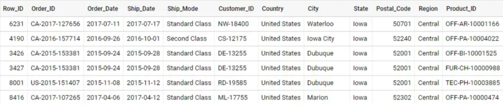
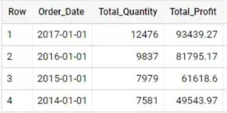
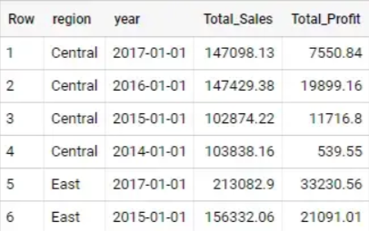
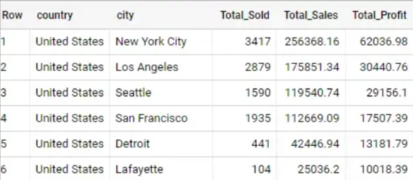
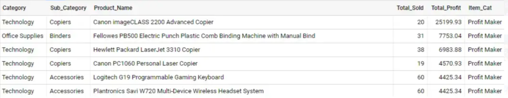
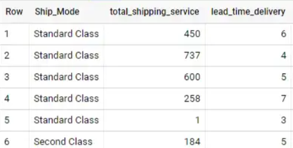

# Superstore Database SQL Analysis

### Description
SQL analysis of the sample Superstore database from kaggle.

## Raw Data
<picture>
 
</picture>

### Source
Dataset from https://www.kaggle.com/datasets/vivek468/superstore-dataset-final

# Analysis
### 1. How do the sales and profit statistics perform over time?

Sales quantity and profit columns were used to explore the superstore performance. We can analyse this by using the sum of the total sales and profit for each year

```
SELECT 
date_trunc(date(order_date),year) as Order_Date,
sum(quantity) as Total_Quantity,
round(sum(Profit),2) as Total_Profit,
FROM `superstore_order`
group by 1
order by 1 desc
```

<picture>
 
</picture>

Between 2014 and 2017, store sales showed significant growth for Sales Quantity and Total Profit. However if we look closer, sales and profit were volatile within Q1 each year.

### 2. Which region has the highest sales?

Region data is used for each area’s productivity. Across all regions, West Region has the highest total sales and profit. This could potentially indicate the possibility of strategy adjustments that can be taken from West Region and applied to the other regions.

```
SELECT 
region,
date_trunc(date(order_date),year) as year, 
round(sum(sales),2) as Total_Sales,
round(sum(Profit),2) as Total_Profit,
FROM `superstore_order`
group by 1,2
order by 1
```

<picture>
 
</picture>

To improve business performance, South Region should be the main area of focus, since the performance is poor due to the drop off in sales performance between 2015 and 2017.

### 3. Which city has the highest profit?

Going into more detail, we can analyse which city has contributed the most to company revenue. This provides insight into which cities are profitable and not profitable.

```
SELECT 
country,
city,
sum(quantity) as Total_Sold,
round(sum(sales),2) as Total_Sales,
round(sum(Profit),2) as Total_Profit,
FROM `superstore_order`
group by 1,2
order by 5 desc
```

<picture>
 
</picture>

New York, Los Angeles, and Seattle are the top 3 most profitable cities. These cities generate most of the total items sold across the United States, which significantly contributes to the company profitability.

### 4. Which item and segment has generated the most profit?

Item and segment can be analysed to maximise store sales performance. Identifying best performing items can lead to marketing and manufacture refinements to boost items sold. It can also be given as direct feedback to the store who can adjust the shelf position and stock held for each item in a more advanced approach.

```
with Item as 
(select
Ca.Product_ID as Product_ID,
Ca.Category as Category,
Ca.Sub_Category as Sub_Category,
Product_Name,
sum(O.quantity) as Total_Sold,
round(sum(O.Profit),2) as Total_Profit
FROM `superstore_categories` as Ca
left join `superstore_order` as O
on Ca.Product_ID = O.Product_ID
group by 1,2,3,4
order by 6 desc
)
,
Item_Pros as (
select
 *,
 case 
 when Total_Profit > 4000 then ‘Profit Maker’
 when Total_Profit between 0 and 4000 then ‘Volume Maker’
 else ‘Not Profitable’
 end as Item_Cat
from Item)
select
 *
from Item_Pros
```

<picture>
 
</picture>

The technology segment is the leading profit-maker among the segments. Followed by office supplies and furniture. It implied for the profitable region/city might optimize the technology segment to boost the company profitability, while maximising the allocation of office supplies and furniture stock and sales.

### 5. How long is the wait from order to shipping time for each shipping option?

From the customer’s perspective, delivery time may affect their satisfaction level. Streamlining the process from order to shipping for the most service options, might increase their satisfaction.

```
with lead_time as 
(
select
  Ship_Mode,
  Order_Date,
  Ship_Date,
  date_diff(ship_date,order_date,Day) as lead_time_delivery 
from `superstore_order`
group by 1,2,3
)
,
shipping as
(
  select
    Ship_Mode,
    count(ship_mode) as total_shipping_service,
--     round(avg(lead_time_delivery),2) as avg_lead_time,
    lead_time_delivery
   from lead_time
   group by 1,3
   order by 1 desc
)
select
  *
from shipping
```

<picture>
 
</picture>

Standard class is the most chosen shipping option. The average lead time for the standard class is 5 days. However, the deviation for the lead time is around 3 to 7 days. There is a possibility that the store could improve the packaging process to deliver the customer’s item faster.

## Conclusion
Through analysing the superstore data, we can make multiple suggestions to improve the profitability and customer satisfaction. The superstore may improve the sales performance by targeting the weak areas highlighted, refine the marketing/ stock levels of popular products and streamline any packaging processes.

## Recommendation
Focus on spreading the successes of the West Region around the company to boost profitability. Pay particular attention on improving the South Region's performance.

Philadelphia, Houston, and San Antonio are not profitable cities. Consider relocating altogether or redesigning the strategies in operation within the store.

Cubify CubeX 3D Printer Double Head Print, Lexmark MX611dhe Monochrome Laser Printer, and Cubify CubeX 3D Printer Triple Head Print are not very profitable items. They could be removed from the item lines. Since the items directly contributed to a loss in profitability.

For the standard class delivery option, improve the processes during the item distribution and packaging. Since the standard class is a high demand option, this will improve customer satisfaction.

## Source
Dataset from https://www.kaggle.com/datasets/vivek468/superstore-dataset-final

